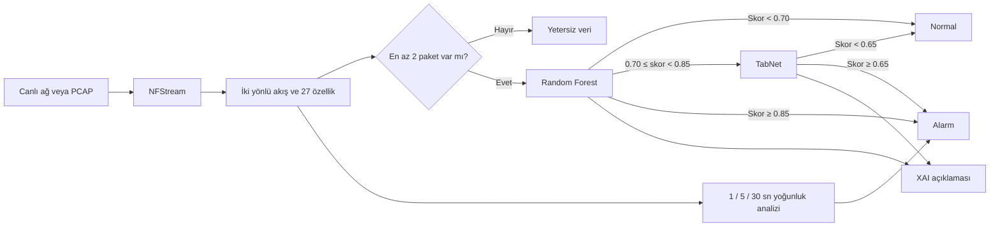
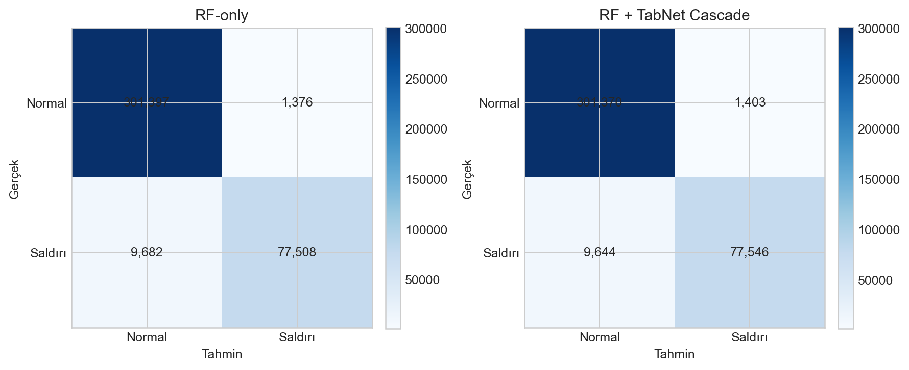
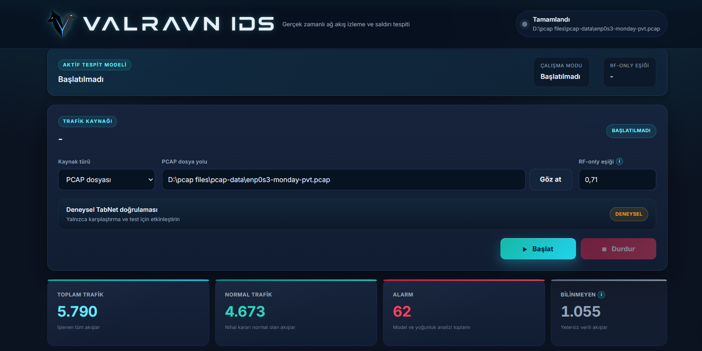
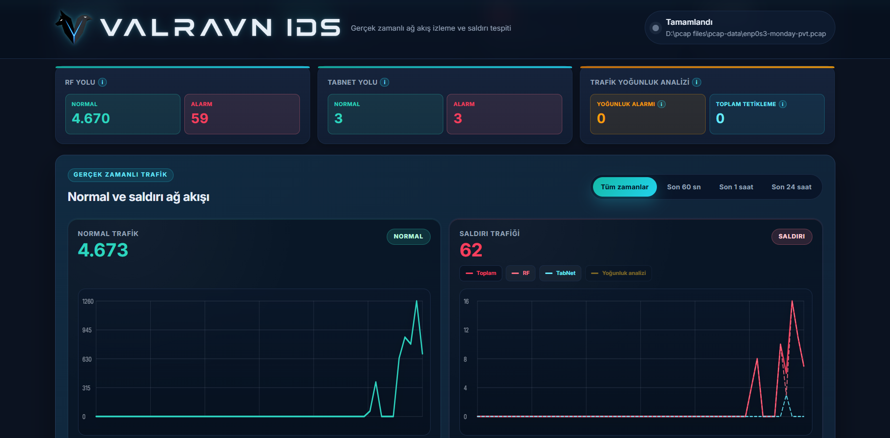
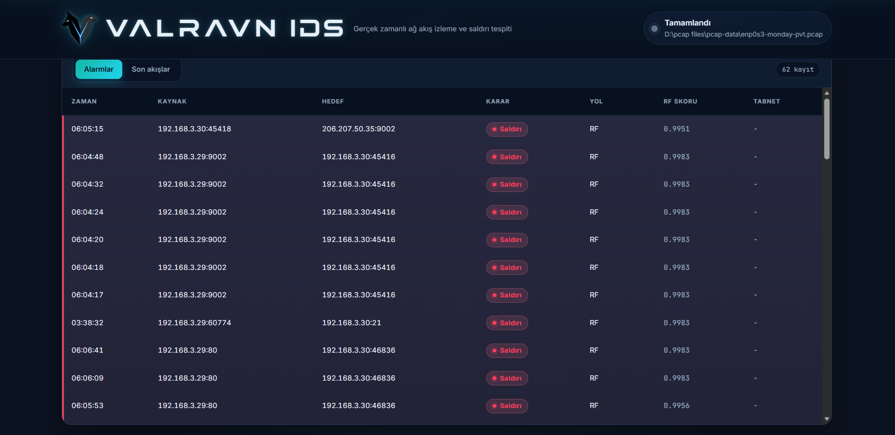
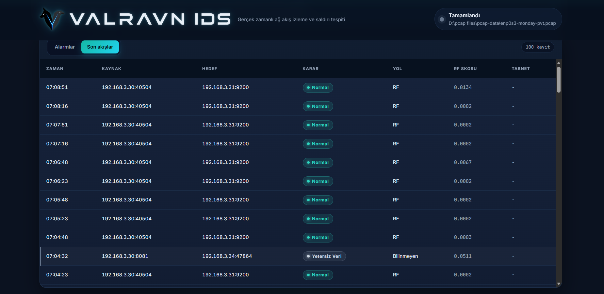
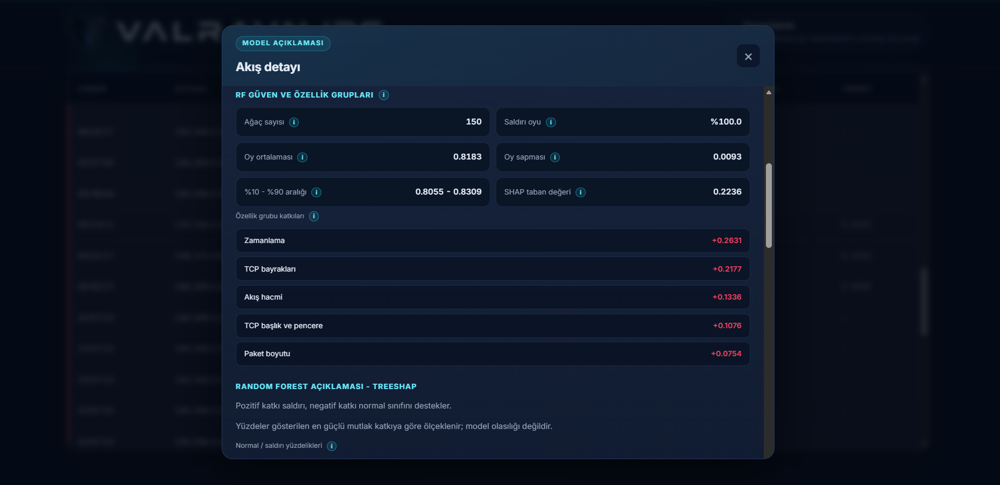

<p align="center">
  
  <br>
  
</p>

<p align="center">
  <strong>Ağ Trafiğinde Anomali ve Saldırı Tespiti:<br>Topluluk Öğrenme ile Açıklanabilir Yapay Zekâ Tabanlı Bir Yaklaşım</strong>
</p>

<p align="center">
  
  
  
</p>

<p align="center">
  
  
  
  
  
  
</p>

---

## 🛡️ Proje Hakkında

**VALRAVN IDS**, ağ paketlerini iki yönlü akışlara dönüştüren, akışları makine öğrenmesi modelleriyle sınıflandıran, yüksek hacimli şüpheli davranışları zaman pencereleriyle izleyen ve verdiği kararları açıklanabilir yapay zekâ çıktılarıyla görünür hâle getiren bir saldırı tespit sistemi araştırma prototipidir.

Çalışma, **Erciyes Üniversitesi Bilgisayar Mühendisliği Bölümü lisans bitirme ödevi** kapsamında **Kasım 2025–Haziran 2026** tarihleri arasında geliştirilmiştir. Proje; veri hazırlama, model karşılaştırması, gerçek zamanlı akış çıkarımı, kademeli karar mekanizması, açıklanabilirlik, web arayüzü ve kontrollü sanal laboratuvar testlerini kapsayan üç fazdan oluşur.

> [!IMPORTANT]
> Bu public depo projenin mimarisini, araştırma yöntemini ve doğrulanmış sonuçlarını tanıtır. Eğitilmiş modeller, özel veri kümeleri ve tam üretim kaynak kodu paylaşılmamıştır. `examples/` klasöründeki kodlar, sistemi öğretmek amacıyla hazırlanmış sadeleştirilmiş ve bağımsız örneklerdir.

## ✨ Öne Çıkan Özellikler

- ⚡ **Gerçek zamanlı ve çevrimdışı analiz:** Canlı ağ arayüzü veya PCAP dosyası üzerinden NFStream akış çıkarımı.
- 🌲 **Hızlı ilk karar katmanı:** Trafiğin büyük bölümü Random Forest ile düşük maliyetle değerlendirilir.
- 🧠 **RF–TabNet cascade:** Yalnızca belirsiz gri bölgedeki akışlar TabNet'e yönlendirilir.
- ⏱️ **Çok pencereli yoğunluk analizi:** 1, 5 ve 30 saniyelik pencerelerde hacim ve davranış kontrolü.
- 🔍 **Açıklanabilir kararlar:** TreeSHAP, RF ağaç oyları, TabNet karar adımları ve duyarlılık analizi.
- 🧩 **Yetersiz veri ayrımı:** Çok kısa akışlar otomatik olarak saldırı sayılmaz; ayrı kategoride izlenir.
- 📊 **Canlı dashboard:** Sayaçlar, karar yolları, grafikler, alarm listesi ve akış ayrıntıları.
- 🧪 **Kontrollü test ortamı:** Kali Linux, Metasploitable 2 ve VMware tabanlı izole laboratuvar.
- 🔄 **Eğitim–canlı uyumu:** Eğitim ve çalışma zamanında aynı NFStream profili ve 27 özellikli şema.
- 📁 **Taşınabilir mimari:** Model manifesti ve ayrık servis yapısı sayesinde farklı sistemlere uyarlanabilir tasarım.

## 🧭 Sistem Nasıl Çalışır?



### Karar eşikleri

| Karar yolu | Koşul | Sonuç |
|---|---:|---|
| RF normal | `RF < 0.70` | Normal trafik |
| RF gri bölge | `0.70 ≤ RF < 0.85` | TabNet doğrulamasına gönderilir |
| RF alarm | `RF ≥ 0.85` | Model alarmı |
| TabNet | `TabNet ≥ 0.65` | Model alarmı |
| RF-only test modu | `RF ≥ 0.71` | Alarm |
| Veri yeterliliği | `< 2 paket` | Yetersiz veri; tek başına alarm değildir |

Gri bölge sınırları rastgele belirlenmemiştir. Kalibrasyon skor dağılımında bu aralık, RF'nin doğrudan karar vermesinin daha riskli olduğu sınırlı bölgeyi ikinci modele yönlendirmek amacıyla seçilmiştir. Ayrıntılı açıklama için [Karar mekanizması ve eşikler](docs/decision-system.md) belgesine bakın.

## 🧱 Üç Fazlı Geliştirme

| Faz | Araştırma odağı | Teknik çıktı |
|---|---|---|
| [**Faz 1**](phase1/README.md) | CIC-IDS-2017 ile temel yaklaşım | Temizleme, özellik seçimi, Random Forest baseline ve hiperparametre optimizasyonu |
| [**Faz 2**](phase2/README.md) | Veri ve model çeşitliliği | Random Forest, Autoencoder, LSTM-AE, TabNet ve alternatif cascade deneyleri |
| [**Faz 3**](phase3/README.md) | Gerçek zamanlı IDS | NFStream ortak şeması, RF–TabNet cascade, yoğunluk analizi, XAI ve VALRAVN dashboard |

## 📅 Proje Zaman Çizelgesi

| Dönem | Çalışma |
|---|---|
| **Kasım–Aralık 2025** | Problem tanımı, literatür incelemesi, IDS ve veri kümesi araştırması |
| **Ocak 2026** | CIC-IDS-2017 birleştirme, temizleme ve ikili etiketleme |
| **Şubat 2026** | Özellik analizi, düşük varyans/korelasyon kontrolleri ve veri ayrımı |
| **Mart 2026** | Random Forest baseline, rastgele arama ve hiperparametre değerlendirmesi |
| **Nisan 2026** | Birleşik veri, Autoencoder, LSTM-AE ve TabNet deneyleri |
| **Mayıs 2026** | Ham PCAP'lerden NFStream akış çıkarımı ve zaman duyarlı etiketleme |
| **Haziran 2026** | Nihai RF–TabNet modeli, eşik seçimi, XAI, canlı dashboard ve saldırı testleri |

## 📈 Etiketli Final Test Sonuçları

Aktif cascade, ayrılmış **389.963 akışlık etiketli final test** üzerinde aşağıdaki sonuçları üretmiştir. Bunlar kontrollü canlı saldırı senaryolarından değil, etiketli test bölümünden hesaplanmıştır.

| Precision | Recall | F1 | FPR | Doğru normal | Yanlış alarm | Kaçırılan saldırı | Doğru saldırı |
|---:|---:|---:|---:|---:|---:|---:|---:|
| **0.9822** | **0.8894** | **0.9335** | **0.00463** | 301.370 | 1.403 | 9.644 | 77.546 |

<p align="center">
  
</p>

> [!NOTE]
> Canlı Nmap ve DoS deneyleri kontrollü vaka çalışmalarıdır. Bağımsız paket/akış düzeyi kesin etiket bulunmadığından bu testlerden varsayımsal precision, recall veya doğruluk değeri üretilmemiştir.

## 🖥️ VALRAVN IDS Arayüzü

<p align="center">
  
</p>

| Trafik ve karar yolu grafikleri | Alarm listesi |
|---|---|
|  |  |

| Normal/yetersiz veri akışları | Model açıklaması |
|---|---|
|  |  |

Tüm ekranlar için [arayüz galerisine](docs/interface.md) bakın.

## 🛠️ Teknoloji Yığını

| Katman | Teknoloji | Projedeki görevi |
|---|---|---|
| Akış çıkarımı | **NFStream**, Npcap | Paketleri iki yönlü akışlara ve istatistiksel özelliklere dönüştürme |
| Makine öğrenmesi | **scikit-learn** | Random Forest eğitimi, olasılık skoru ve metrikler |
| Derin öğrenme | **PyTorch TabNet** | RF gri bölgesindeki akışların ikinci aşama doğrulaması |
| Veri işleme | **pandas**, **NumPy**, **joblib** | Temizleme, dönüşüm, tablo işleme ve artefakt yükleme |
| Optimizasyon | **Optuna**, scikit-learn arama araçları | Hiperparametre ve karar eşiği araştırmaları |
| Açıklanabilirlik | **SHAP / TreeSHAP**, TabNet explain | Özellik katkısı ve karar adımı incelemesi |
| API | **FastAPI**, **Uvicorn**, Pydantic | Canlı servis, durum ve akış ayrıntısı uçları |
| Arayüz | **HTML5**, **CSS3**, **JavaScript** | Gerçek zamanlı dashboard ve etkileşimli grafikler |
| Değerlendirme | matplotlib, seaborn, psutil | Grafikler, metrik raporları ve benchmark ölçümleri |
| Test ortamı | VMware, Kali Linux, Metasploitable 2 | İzole port taraması ve DoS vaka çalışmaları |

### Kullanılan programlama dilleri

Oranlar; ana projenin Faz 1–3 kaynaklarında veri, model, rapor ve önbellek klasörleri çıkarıldıktan sonra kalan **29.739 boş olmayan kaynak satırı** üzerinden 1 Temmuz 2026 tarihinde hesaplanmıştır. Bu nedenle GitHub'ın dosya baytı tabanlı dil göstergesinden farklı olabilir.

| Dil | Kaynak satırı | Oran | Kullanım alanı |
|---|---:|---:|---|
| 🐍 **Python** | 27.422 | **%92,2** | Ön işleme, eğitim, değerlendirme, NFStream çalışma zamanı, API ve XAI |
| 🎨 **CSS** | 1.137 | **%3,8** | VALRAVN IDS görsel tasarımı ve responsive yerleşim |
| 🟨 **JavaScript** | 852 | **%2,9** | Dashboard durumu, grafikler, tablolar ve kullanıcı etkileşimi |
| 🌐 **HTML** | 328 | **%1,1** | Arayüzün semantik sayfa yapısı |

```text
Python      ██████████████████████████████████████████████  92,2%
CSS         ██                                               3,8%
JavaScript  █                                                2,9%
HTML        ▌                                                1,1%
```

## 🧪 Veri ve Deney İlkeleri

- Eğitim ve canlı çıkarım aynı **27 özellikli NFStream sözleşmesini** kullanır.
- Aktif akış profili `idle_timeout=15` ve `active_timeout=30` saniyedir.
- TabNet dönüşümü yalnızca eğitim verisinde öğrenilen `SignedLogRobustScaler` ile yapılır.
- Eğitim, kalibrasyon ve final test görevleri birbirinden ayrılmıştır.
- Eşikler yalnızca accuracy ile değil; precision, recall, F1, FPR ve kaynak bazlı davranışla değerlendirilmiştir.
- Çok kısa akışlar saldırı kabul edilmez ve **yetersiz veri** olarak raporlanır.
- Public depoda gerçek veri kümesi veya gerçek akış kaydı dağıtılmaz.

## 📚 Dokümantasyon

| Belge | İçerik |
|---|---|
| [Sistem mimarisi](docs/architecture.md) | NFStream, model, servis ve sunum katmanları |
| [Karar mekanizması](docs/decision-system.md) | RF gri bölgesi, TabNet eşiği ve yoğunluk analizi |
| [Veri ve eğitim](docs/data-and-training.md) | Veri kaynakları, zaman duyarlı etiketleme ve model eğitimi |
| [Değerlendirme](docs/evaluation.md) | Final test, canlı vaka çalışmaları ve sınırlılıklar |
| [Açıklanabilir yapay zekâ](docs/xai.md) | TreeSHAP ve TabNet açıklamalarının yorumu |
| [Arayüz galerisi](docs/interface.md) | Dashboard ve akış ayrıntısı ekranları |
| [Egitsel örnekler](examples/README.md) | Sentetik veri ve sadeleştirilmiş karar kodları |

## 📂 Public Repo Yapısı

```text
Valravn-IDS/
├── assets/screenshots/     # Arayüz görüntüleri
├── docs/                   # Teknik ve akademik açıklamalar
├── examples/               # Sadeleştirilmiş örnek kod ve sentetik veri
├── phase1/                 # Faz 1 özeti
├── phase2/                 # Faz 2 özeti
├── phase3/                 # Faz 3 özeti ve rapor görselleri
└── README.md
```

## ⚠️ Güvenlik, Etik ve Sınırlılıklar

Canlı saldırı testleri yalnızca izole ve izinli sanal laboratuvarda gerçekleştirilmiştir. Bu depo saldırı üretme aracı içermez. VALRAVN IDS akademik bir araştırma prototipidir; sertifikalı kurumsal IDS/IPS ürününün yerine geçtiği iddia edilmemektedir.

Model performansı eğitim ve test dağılımına bağlıdır. Farklı kurum ağlarında yeniden kalibrasyon, normal trafik tabanı, izleme ve güvenlik politikaları gerekir. Gelecek çalışmalarda daha zengin sentetik trafik, farklı ağlarda dış doğrulama ve imza tabanlı IDS motorlarıyla yapay zekâ kararlarının birleştirilmesi değerlendirilebilir.

## 👤 Geliştirici

**Mehmet Kul**  
Erciyes Üniversitesi, Bilgisayar Mühendisliği Bölümü  
Lisans Bitirme Ödevi, 2025–2026

## 📄 Telif ve Kullanım

Bu depodaki özgün dokümantasyon, görseller ve eğitsel örnekler için tüm haklar saklıdır. İçerik açık kaynak lisansı kapsamında sunulmamaktadır; yazılı izin olmadan kopyalanamaz, değiştirilemez veya yeniden dağıtılamaz. Akademik çalışmalarda uygun atıf verilerek kaynak olarak gösterilebilir. Veri kümeleri ve üçüncü taraf teknolojiler kendi lisans ve kullanım koşullarına tabidir.

---

<p align="center">
  <strong>VALRAVN IDS</strong><br>
  Gerçek zamanlı ağ akışı izleme · Kademeli yapay zekâ · Açıklanabilir kararlar
</p>
