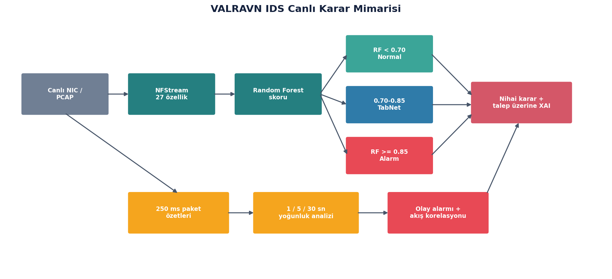

# Sistem Mimarisi

## Veri duzlemi

NFStream, ayni iletisim oturumuna ait paketleri iki yonlu bir akis kaydinda toplar. Akis kimligi kaynak IP, hedef IP, kaynak port, hedef port ve tasima protokolu bilesiminden turetilir; ters yondeki paketler ayni iki yonlu kayda eklenir.

Aktif profil iki zaman siniri kullanir:

- **Bos kalma zaman asimi (15 sn):** Bir akista 15 saniye yeni paket gorulmezse akis tamamlanir.
- **Etkin akis zaman asimi (30 sn):** Trafik devam etse bile 30 saniyeye ulasan akis parcalanarak modele gonderilir. Bu, uzun sureli baglantilarin karar icin sonsuza kadar beklemesini engeller.

Akistan sure, paket/byte sayilari, paket boyutu istatistikleri, paketler arasi sureler, iki yonun ayri hacimleri ve TCP kontrol bayraklari dahil 27 ozellik uretilir.

## Model duzlemi

RF ham buyuklukleri temizlenmis sayisal bicimde kullanir. Yalnizca gri bolgeye giren akislar icin imzali logaritmik donusum ve dayanikli olcekleme uygulanir; bu ikinci temsil TabNet'e verilir. Boylece RF yolu gereksiz normalizasyon maliyeti tasimaz.

## Servis ve sunum duzlemi

FastAPI, baslatma/durdurma, arayuz listeleme, durum ve akis ayrintisi uclarini saglar. Uvicorn HTTP sunucusudur. Tarayici arayuzu periyodik durum istekleriyle sayaclari, grafikleri ve son akis listesini gunceller.

