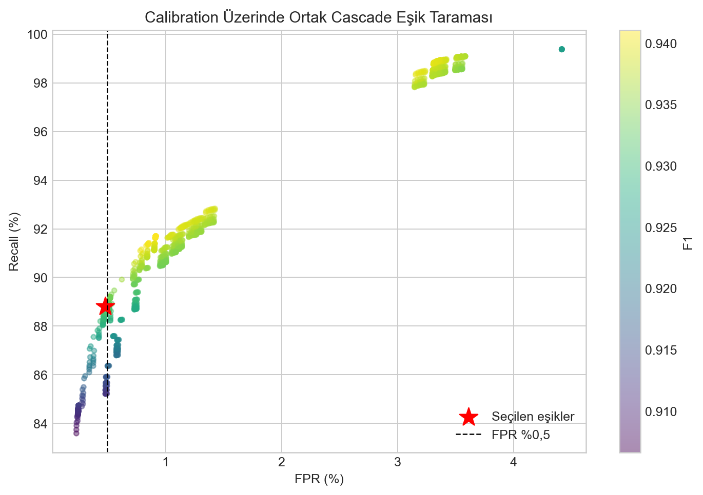

# Karar Mekanizmasi ve Esikler

## Akis yeterliligi

Iki paketten az veri iceren bir akis, model skoru bulunsa bile guvenilir davranis ozeti sunmaz. Bu kayitlar **yetersiz veri** olarak ayrilir. Yetersiz veri etiketi saldiri anlami tasimaz ve trafik yogunluk katmani yalnizca bu etikete dayanarak alarm uretemez.

## RF-TabNet cascade

Random Forest saldiri olasiligini `p_RF` ile uretir:

```text
p_RF < 0.70           -> Normal
0.70 <= p_RF < 0.85  -> Gri bolge, TabNet'e yonlendir
p_RF >= 0.85          -> Alarm
```

Gri bolge, kalibrasyon skor dagilimi ve hata maliyeti incelenerek secilmistir. Nihai analizde `0.70` altinda 301.169 normal ve 9.414 saldiri; gri bolgede 602 normal ve 2.235 saldiri; `0.85` ve ustunde 984 normal ve 75.527 saldiri bulunmustur. Bu dagilim, ikinci modeli tum trafik yerine sinirli fakat riskli bolgede calistirmayi destekler.

TabNet gri bolge akisinda `p_TabNet >= 0.65` ise alarm, aksi halde normal karari verir. RF-only test modunda tek esik `0.71`dir.



## Trafik yogunluk analizi

Canli sistem son 1, 5 ve 30 saniyedeki paket/byte hizi, yeni akis sayisi, ayni hedefe yonelim, hedef port cesitliligi, UDP/ICMP hacmi ve TCP kontrol paketlerini birlikte izler. Birden fazla kanitin esik asmasi, kisa sureli ani yuk ile devamli yogunlugu ayirt etmeye yardim eder. Bu katman yalnizca SYN paketlerine bagli degildir.

Yogunluk mekanizmasi modelin egitimli siniflandirmasindan farkli, istatistiksel bir canli koruma katmanidir. Bu nedenle arayuzde alarm yolunun RF, TabNet veya Trafik Yogunluk Analizi oldugu ayrica gosterilir.
