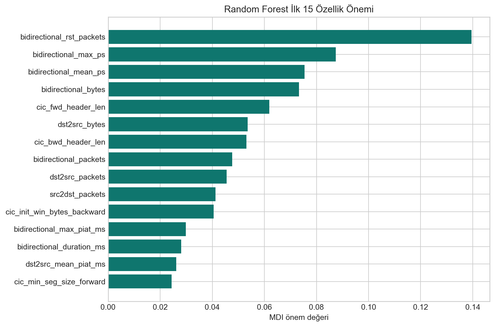

# Aciklanabilir Yapay Zeka

RF yolu icin TreeSHAP, model skorunu ozellik katkilarina ayirir. Pozitif katkilar saldiri skorunu, negatif katkilar normal skorunu destekler. Agac oy dagilimi, modeldeki 150 agacin hangi sinifa oy verdigini ek kanit olarak sunar.

TabNet gri bolge akislarini bes karar adiminda inceler. Her adim farkli ozelliklere attention maskesi uygular. Arayuz, adim bazli odagi ve girdide yapilan kucuk degisikliklerin saldiri olasiligina etkisini birlikte sunar; attention agirligi tek basina nedensellik olarak yorumlanmaz.

XAI ciktisi karar vericinin yerine gecmez. Amaci, alarm incelemesinde hangi akis ozelliklerinin modeli etkiledigini izlenebilir hale getirmektir.
