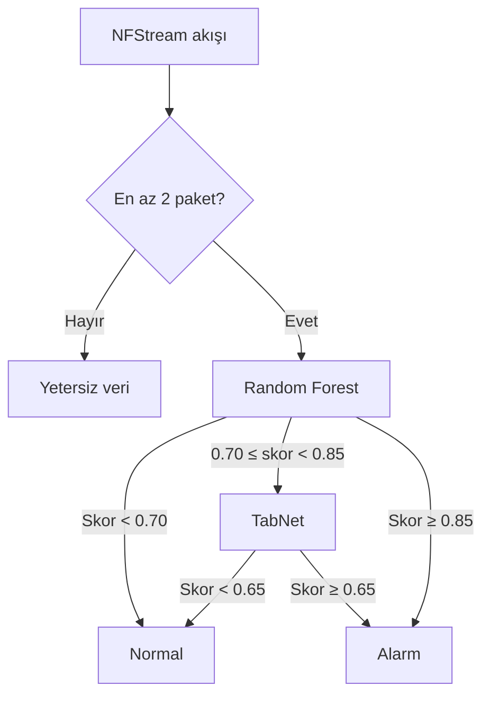

# Faz 3 - NFStream Tabanlı Gerçek Zamanlı VALRAVN IDS

## Amaç

Faz 3, projenin nihai uygulama aşamasıdır. Eğitim ve canlı çalışmada aynı akış çıkarım sözleşmesini kullanmak, hızlı Random Forest kararlarını TabNet doğrulamasıyla desteklemek, yüksek trafik davranışlarını zaman pencereleriyle izlemek ve kararları açıklanabilir yapay zekâ çıktılarıyla sunmak hedeflenmiştir.

Bu fazda geliştirilen ana bileşenler:

- Canlı ağ arayüzü ve PCAP dosyası desteği,
- NFStream tabanlı iki yönlü akış çıkarımı,
- Eğitim ve canlı sistemde ortak 27 özellikli şema,
- Random Forest–TabNet kademeli karar mekanizması,
- 1, 5 ve 30 saniyelik trafik yoğunluk analizi,
- Yetersiz verili akışların ayrı gösterilmesi,
- TreeSHAP ve TabNet karar adımı açıklamaları,
- FastAPI tabanlı servis ve VALRAVN IDS dashboard,
- İzole sanal laboratuvarda Nmap ve DoS vaka testleri.

## Neden NFStream?

Faz 2'de farklı akış çıkarıcıların aynı adlı özellikleri farklı biçimde hesaplayabildiği görülmüştür. Bu nedenle Faz 3'te ham PCAP dosyaları ortak NFStream profiliyle yeniden işlenmiş, model eğitimi ve canlı çıkarım aynı sözleşmeye bağlanmıştır.

NFStream'in sağladığı başlıca avantajlar:

- PCAP ve canlı ağ arayüzü desteği,
- Python ile doğrudan bütünleşme,
- Çift yönlü akış istatistikleri,
- Özel eklentilerle ek özellik üretimi,
- Eğitim ve çalışma zamanında aynı profilin kullanılabilmesi.

NFStream canlı kullanımda akışları zorunlu olarak CSV'ye yazmaz. Tamamlanan akış nesnesi doğrudan temizleme ve model çıkarım hattına verilir. CSV yalnız veri hazırlama veya hata ayıklama amacıyla kullanılabilir.

## Ortak Akış Profili

| Ayar | Değer | Açıklama |
|---|---:|---|
| Boş kalma zaman aşımı | 15 saniye | Yeni paket gelmeyen akış tamamlanır |
| Etkin akış zaman aşımı | 30 saniye | Uzun akış karar için parçalara ayrılır |
| İstatistiksel analiz | Etkin | Paket boyutu ve zaman istatistikleri hesaplanır |
| Asgari karar verisi | 2 paket | Daha kısa akışlar model alarmı sayılmaz |

Zaman aşımı değerleri yalnız performans ayarı değildir; aynı paket dizisinin kaç akışa bölüneceğini ve özellik dağılımını belirler. Profil değiştirildiğinde modelin aynı profille yeniden eğitilmesi gerekir.

## 27 Özellikli Ortak Şema

Nihai özellikler şu gruplardan oluşur:

- Çift yönlü süre, paket ve byte sayıları,
- Paket boyutunun minimum, ortalama ve maksimum değerleri,
- Paketler arası süre istatistikleri,
- Kaynaktan hedefe ve hedeften kaynağa ayrı hacim değerleri,
- SYN, RST ve FIN kontrol paketi sayıları,
- İleri ve geri yön başlık uzunlukları,
- Segment ve başlangıç pencere büyüklüğü gibi uyumluluk alanları.

Random Forest temizlenmiş ham sayısal özellikleri kullanır. Yalnız gri bölgeye giren akışlar işareti koruyan logaritmik dönüşüm ve aykırı değerlere dayanıklı ölçekleme sonrasında TabNet'e gönderilir.

## RF–TabNet Cascade

RF-only karşılaştırma eşiği `0,71`dir.

### Gri bölgenin gerekçesi

Kalibrasyon skor dağılımı incelendiğinde:

| RF skor bölgesi | Normal | Saldırı |
|---|---:|---:|
| `< 0,70` | 301.169 | 9.414 |
| `0,70–0,85` | 602 | 2.235 |
| `≥ 0,85` | 984 | 75.527 |

Gri bölge, ikinci modele gönderilecek örnek sayısını sınırlarken riskli akışları yoğunlaştırır. Böylece Random Forest'ın hızı ve TabNet'in ek doğrulama kapasitesi birlikte kullanılır.

## Yetersiz Veri Politikası

İki paketten az akışlar güvenilir çift yönlü davranış özeti sağlamaz. Bu kayıtlar:

- Normal veya saldırı kabul edilmez,
- TabNet'e gönderilmez,
- Ayrı “Yetersiz Veri/Bilinmeyen” sayacında gösterilir,
- Tek başına yoğunluk alarmına dönüştürülmez.

Bu politika, çok kısa bağlantı parçalarının otomatik olarak saldırı sayılmasını engeller.

## Trafik Yoğunluk Analizi

Akış modelleri tamamlanmış akışları değerlendirirken yoğunluk katmanı devam eden paket davranışını 1, 5 ve 30 saniyelik hareketli pencerelerde izler.

İncelenen göstergeler:

- Paket ve byte hızı,
- Yeni akış sayısı,
- Aynı hedefe yönelen trafik,
- Kaynak/hedef ve port çeşitliliği,
- SYN, RST ve FIN kontrol paketleri,
- UDP ve ICMP yoğunluğu,
- Birden fazla zaman penceresinde devamlı eşik aşımı.

Bu mekanizma yalnız SYN flood için tasarlanmamıştır. TCP kontrol flood, UDP/ICMP yoğunluğu, port çeşitliliği ve genel hacim davranışlarını birlikte değerlendirebilir.

Offline PCAP analizinde dosyanın hızlı okunması gerçek zamanlı trafik yoğunluğu olarak yorumlanmaz; canlı yoğunluk katmanı model kararını geçersiz kılmaz.

## Açıklanabilir Yapay Zekâ

### Random Forest

- TreeSHAP özellik katkıları,
- Model ağaçlarının normal/saldırı oy dağılımı,
- Özellik değerlerinin eğitim dağılımındaki konumu,
- Özellik grubu bazında toplam katkı gösterilir.

### TabNet

- Beş karar adımının dikkat ağırlıkları,
- Her adımda öne çıkan özellikler,
- Özellik duyarlılık analizi,
- Nihai skor ve eşik farkı sunulur.

XAI çıktıları nedensellik kanıtı değildir. Amaç, model kararının hangi ölçümlere dayandığını incelemeyi kolaylaştırmaktır. Ayrıntı: [XAI belgesi](../docs/xai.md).

## Etiketli Final Test

Aktif cascade, 389.963 akışlık ayrılmış final testte aşağıdaki sonucu üretmiştir:

| Ölçüt | Değer |
|---|---:|
| Precision | 0,98223 |
| Recall | 0,88939 |
| F1 | 0,93351 |
| FPR | 0,00463 |
| Doğru normal | 301.370 |
| Yanlış alarm | 1.403 |
| Kaçırılan saldırı | 9.644 |
| Doğru saldırı | 77.546 |

Bu metrikler etiketli final test bölümüne aittir. Farklı bir kurum ağında aynı performansın garanti edildiği anlamına gelmez.

## Kontrollü Canlı Testler

Canlı sistem izole VMware ağında Kali Linux ve Metasploitable 2 kullanılarak incelenmiştir. Nmap port taraması ve kontrollü DoS trafiğinde:

- Ağ arayüzü üzerinden akış üretimi,
- Model ve yoğunluk karar yolları,
- Dashboard sayaç ve grafikleri,
- Alarm listesi ve XAI ayrıntıları gözlemlenmiştir.

Canlı testlerde bağımsız akış düzeyi kesin etiket bulunmadığından bu vaka kayıtlarından precision, recall veya accuracy hesaplanmamıştır.

## Arayüz

VALRAVN IDS dashboard aşağıdaki bölümleri içerir:

- Canlı ağ veya PCAP kaynak seçimi,
- Toplam, normal, alarm ve yetersiz veri sayaçları,
- RF, TabNet ve yoğunluk analizi karar yolu sayaçları,
- Normal ve saldırı trafik grafikleri,
- Alarm ve son akış listeleri,
- Akış bağlantı/model bilgileri,
- RF ve TabNet açıklama ekranları.

Ekran görüntüleri için [arayüz galerisine](../docs/interface.md) bakın.

## Faz 3'ün Sonucu

Faz 3 ile araştırma, çevrimdışı model karşılaştırmasından gerçek zamanlı ve açıklanabilir bir IDS prototipine dönüştürülmüştür. Nihai sistem:

- Hızlı ve kademeli karar verir,
- Eğitim–canlı akış uyumunu korur,
- Yetersiz veriyi saldırıdan ayırır,
- Tek bir DoS türüne bağlı olmayan davranış katmanı içerir,
- Karar yolunu ve model açıklamasını kullanıcıya sunar.

Teknik belgeler:

- [Sistem mimarisi](../docs/architecture.md)
- [Karar mekanizması](../docs/decision-system.md)
- [Veri ve eğitim](../docs/data-and-training.md)
- [Değerlendirme ve sınırlılıklar](../docs/evaluation.md)

